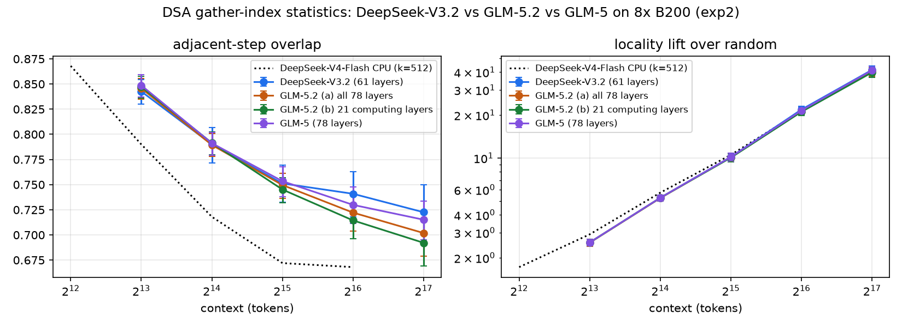
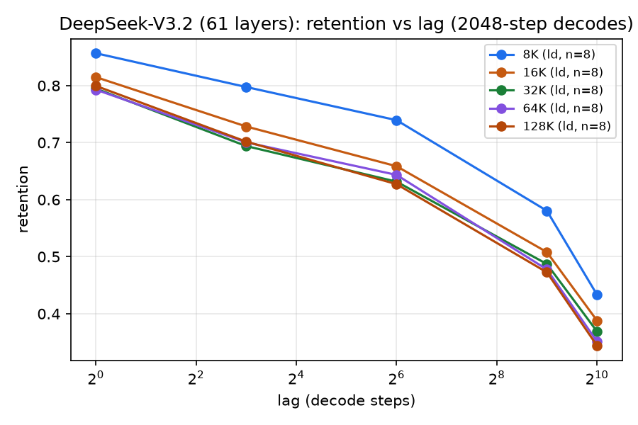
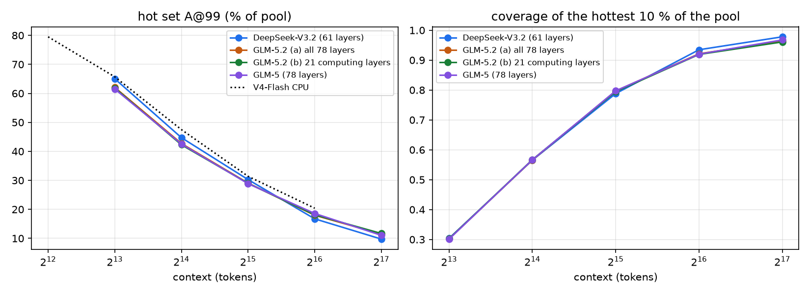
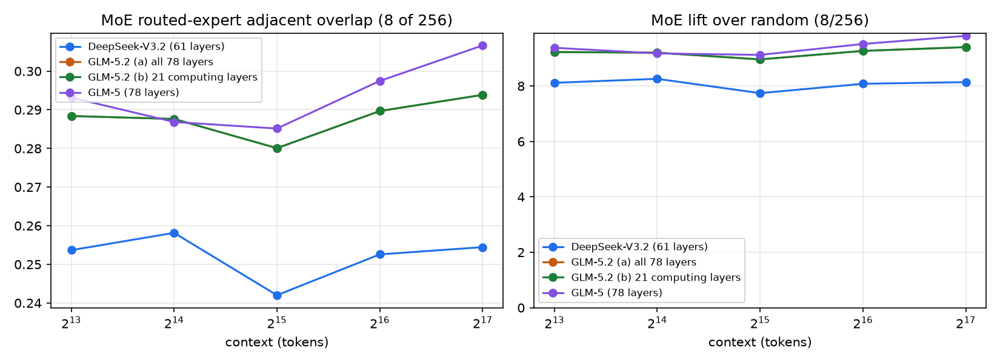

# DSA gather-index statistics: DeepSeek-V3.2 vs GLM-5.2 vs GLM-5 on 8x B200 (exp2)

Generated by `scripts/gpu/make_gpu_sweep_summary.py` from sweep_v32.json, sweep_glm52_glm52_a.json, sweep_glm52_glm52_b.json, sweep_glm5_glm5.json.
Every number is the mean over runs of the rung (bf + ld unless noted), with 95 % bootstrap CI over runs; run ids are in the CSVs.

## DeepSeek-V3.2 (61 layers)

### R1 — KV top-k locality (all runs of the rung)

| context | n | adj. overlap [CI] | lift vs random [CI] | recency baseline | ret@8 | ret@64 | ret@512 (ld) | ret@1024 (ld) | CPU V4 overlap / lift |
|---:|---:|---|---|---:|---:|---:|---:|---:|---|
| 8K | 28 | 0.843 [0.830, 0.854] | 2.56× [2.43, 2.70] | 0.491 | 0.768 | 0.722 | 0.580 | 0.433 | 0.790 / 2.9× |
| 16K | 28 | 0.790 [0.772, 0.807] | 5.27× [5.00, 5.52] | 0.385 | 0.695 | 0.627 | 0.508 | 0.388 | 0.718 / 5.7× |
| 32K | 28 | 0.751 [0.732, 0.770] | 10.19× [9.53, 10.81] | 0.320 | 0.636 | 0.584 | 0.487 | 0.369 | 0.672 / 10.5× |
| 64K | 27 | 0.741 [0.718, 0.763] | 21.87× [20.66, 23.00] | 0.302 | 0.626 | 0.602 | 0.478 | 0.351 | 0.668 / 21.4× |
| 128K | 24 | 0.723 [0.693, 0.750] | 41.49× [38.46, 44.22] | 0.307 | 0.611 | 0.609 | 0.473 | 0.344 | — |

### R2 — MoE routed-expert locality

| context | n | adj. overlap [CI] | lift vs 8/256 [CI] |
|---:|---:|---|---|
| 8K | 28 | 0.254 [0.240, 0.265] | 8.1× [7.7, 8.5] |
| 16K | 28 | 0.258 [0.241, 0.279] | 8.3× [7.7, 8.9] |
| 32K | 28 | 0.242 [0.228, 0.254] | 7.7× [7.3, 8.1] |
| 64K | 27 | 0.253 [0.239, 0.264] | 8.1× [7.7, 8.5] |
| 128K | 24 | 0.254 [0.239, 0.267] | 8.1× [7.6, 8.6] |

### R3 — hot-set coverage

| context | n | pool N | A@99 (% of pool) [CI] | B@99 | top-1 % cov | top-5 % cov | top-10 % cov (MEASURED_TOP10) |
|---:|---:|---:|---|---:|---:|---:|---:|
| 8K | 28 | 6576 | 65.0 [59.8, 70.6] | 72.4 | 0.032 | 0.157 | 0.304 |
| 16K | 28 | 14014 | 44.7 [37.8, 52.1] | 52.1 | 0.068 | 0.317 | 0.565 |
| 32K | 28 | 28271 | 30.3 [24.3, 36.8] | 37.0 | 0.134 | 0.546 | 0.788 |
| 64K | 27 | 60865 | 16.7 [13.1, 20.7] | 22.0 | 0.270 | 0.802 | 0.935 |
| 128K | 24 | 118718 | 9.7 [7.2, 12.3] | 13.2 | 0.472 | 0.924 | 0.978 |

### Accuracy sanity (bf runs, our scorer; no official numbers for these sub-samples)

| context | source | n | accuracy | mean score |
|---:|---|---:|---:|---:|
| 8K | infinitebench | 4 | 0.50 | 0.565 |
| 8K | longbench_v1 | 4 | — | 0.189 |
| 8K | longbench_v2 | 4 | 0.25 | 0.250 |
| 8K | ruler | 8 | 0.62 | 0.625 |
| 16K | infinitebench | 4 | 0.25 | 0.315 |
| 16K | longbench_v1 | 4 | — | 0.230 |
| 16K | longbench_v2 | 4 | 0.25 | 0.250 |
| 16K | ruler | 8 | 0.75 | 0.750 |
| 32K | infinitebench | 4 | 0.50 | 0.586 |
| 32K | longbench_v1 | 4 | — | 0.180 |
| 32K | longbench_v2 | 4 | 0.50 | 0.500 |
| 32K | ruler | 8 | 0.75 | 0.750 |
| 64K | infinitebench | 4 | 0.75 | 0.814 |
| 64K | longbench_v1 | 3 | — | 0.193 |
| 64K | longbench_v2 | 4 | 0.25 | 0.250 |
| 64K | ruler | 8 | 0.88 | 0.875 |
| 128K | infinitebench | 4 | 0.75 | 0.818 |
| 128K | longbench_v2 | 4 | 0.25 | 0.250 |
| 128K | ruler | 8 | 0.75 | 0.750 |

## GLM-5.2 (a) all 78 layers

### R1 — KV top-k locality (all runs of the rung)

| context | n | adj. overlap [CI] | lift vs random [CI] | recency baseline | ret@8 | ret@64 | ret@512 (ld) | ret@1024 (ld) | CPU V4 overlap / lift |
|---:|---:|---|---|---:|---:|---:|---:|---:|---|
| 8K | 28 | 0.846 [0.835, 0.856] | 2.55× [2.42, 2.70] | 0.491 | 0.785 | 0.714 | 0.556 | 0.442 | 0.790 / 2.9× |
| 16K | 28 | 0.789 [0.778, 0.801] | 5.25× [4.99, 5.47] | 0.387 | 0.703 | 0.606 | 0.461 | 0.359 | 0.718 / 5.7× |
| 32K | 28 | 0.750 [0.736, 0.761] | 10.13× [9.43, 10.78] | 0.324 | 0.656 | 0.570 | 0.427 | 0.335 | 0.672 / 10.5× |
| 64K | 27 | 0.722 [0.704, 0.739] | 21.32× [20.11, 22.40] | 0.300 | 0.630 | 0.523 | 0.377 | 0.303 | 0.668 / 21.4× |
| 128K | 24 | 0.702 [0.679, 0.723] | 40.40× [37.39, 42.90] | 0.290 | 0.606 | 0.530 | 0.358 | 0.291 | — |

### R2 — MoE routed-expert locality

| context | n | adj. overlap [CI] | lift vs 8/256 [CI] |
|---:|---:|---|---|
| 8K | 28 | 0.288 [0.271, 0.304] | 9.2× [8.7, 9.7] |
| 16K | 28 | 0.288 [0.274, 0.300] | 9.2× [8.8, 9.6] |
| 32K | 28 | 0.280 [0.262, 0.296] | 9.0× [8.4, 9.5] |
| 64K | 27 | 0.290 [0.271, 0.306] | 9.3× [8.7, 9.8] |
| 128K | 24 | 0.294 [0.277, 0.309] | 9.4× [8.9, 9.9] |

### R3 — hot-set coverage

| context | n | pool N | A@99 (% of pool) [CI] | B@99 | top-1 % cov | top-5 % cov | top-10 % cov (MEASURED_TOP10) |
|---:|---:|---:|---|---:|---:|---:|---:|
| 8K | 28 | 6537 | 62.1 [55.5, 68.9] | 68.2 | 0.032 | 0.155 | 0.302 |
| 16K | 28 | 13965 | 42.7 [34.9, 50.8] | 48.6 | 0.067 | 0.314 | 0.566 |
| 32K | 28 | 28126 | 29.1 [22.2, 36.5] | 35.0 | 0.133 | 0.552 | 0.797 |
| 64K | 27 | 60827 | 18.0 [13.4, 22.9] | 22.9 | 0.265 | 0.793 | 0.921 |
| 128K | 24 | 118869 | 11.5 [7.5, 15.6] | 15.0 | 0.462 | 0.908 | 0.963 |

### Accuracy sanity (bf runs, our scorer; no official numbers for these sub-samples)

| context | source | n | accuracy | mean score |
|---:|---|---:|---:|---:|
| 8K | infinitebench | 4 | 0.50 | 0.537 |
| 8K | longbench_v1 | 4 | — | 0.200 |
| 8K | longbench_v2 | 4 | 0.25 | 0.250 |
| 8K | ruler | 8 | 0.88 | 0.875 |
| 16K | infinitebench | 4 | 0.75 | 0.814 |
| 16K | longbench_v1 | 4 | — | 0.229 |
| 16K | longbench_v2 | 4 | 0.25 | 0.250 |
| 16K | ruler | 8 | 0.88 | 0.875 |
| 32K | infinitebench | 4 | 0.75 | 0.804 |
| 32K | longbench_v1 | 4 | — | 0.206 |
| 32K | longbench_v2 | 4 | 0.50 | 0.500 |
| 32K | ruler | 8 | 0.88 | 0.875 |
| 64K | infinitebench | 4 | 0.75 | 0.857 |
| 64K | longbench_v1 | 3 | — | 0.212 |
| 64K | longbench_v2 | 4 | 0.50 | 0.500 |
| 64K | ruler | 8 | 1.00 | 1.000 |
| 128K | infinitebench | 4 | 0.75 | 0.791 |
| 128K | longbench_v2 | 4 | 0.25 | 0.250 |
| 128K | ruler | 8 | 0.75 | 0.750 |

## GLM-5.2 (b) 21 computing layers

### R1 — KV top-k locality (all runs of the rung)

| context | n | adj. overlap [CI] | lift vs random [CI] | recency baseline | ret@8 | ret@64 | ret@512 (ld) | ret@1024 (ld) | CPU V4 overlap / lift |
|---:|---:|---|---|---:|---:|---:|---:|---:|---|
| 8K | 28 | 0.847 [0.836, 0.858] | 2.56× [2.42, 2.71] | 0.490 | 0.784 | 0.717 | 0.557 | 0.451 | 0.790 / 2.9× |
| 16K | 28 | 0.791 [0.780, 0.803] | 5.26× [5.01, 5.49] | 0.383 | 0.704 | 0.612 | 0.465 | 0.371 | 0.718 / 5.7× |
| 32K | 28 | 0.745 [0.732, 0.757] | 10.07× [9.37, 10.71] | 0.315 | 0.650 | 0.571 | 0.425 | 0.343 | 0.672 / 10.5× |
| 64K | 27 | 0.714 [0.696, 0.732] | 21.09× [19.88, 22.17] | 0.290 | 0.621 | 0.520 | 0.371 | 0.308 | 0.668 / 21.4× |
| 128K | 24 | 0.692 [0.669, 0.713] | 39.83× [36.85, 42.28] | 0.279 | 0.595 | 0.522 | 0.351 | 0.294 | — |

### R2 — MoE routed-expert locality

| context | n | adj. overlap [CI] | lift vs 8/256 [CI] |
|---:|---:|---|---|
| 8K | 28 | 0.288 [0.271, 0.304] | 9.2× [8.7, 9.7] |
| 16K | 28 | 0.288 [0.274, 0.300] | 9.2× [8.8, 9.6] |
| 32K | 28 | 0.280 [0.262, 0.296] | 9.0× [8.4, 9.5] |
| 64K | 27 | 0.290 [0.271, 0.306] | 9.3× [8.7, 9.8] |
| 128K | 24 | 0.294 [0.277, 0.309] | 9.4× [8.9, 9.9] |

### R3 — hot-set coverage

| context | n | pool N | A@99 (% of pool) [CI] | B@99 | top-1 % cov | top-5 % cov | top-10 % cov (MEASURED_TOP10) |
|---:|---:|---:|---|---:|---:|---:|---:|
| 8K | 28 | 6537 | 61.8 [55.5, 68.5] | 68.0 | 0.032 | 0.155 | 0.302 |
| 16K | 28 | 13965 | 42.3 [34.7, 50.2] | 48.0 | 0.067 | 0.314 | 0.567 |
| 32K | 28 | 28126 | 29.0 [22.3, 36.1] | 34.8 | 0.132 | 0.550 | 0.795 |
| 64K | 27 | 60827 | 18.1 [13.5, 23.0] | 22.9 | 0.263 | 0.788 | 0.919 |
| 128K | 24 | 118869 | 11.7 [7.7, 15.9] | 15.2 | 0.457 | 0.904 | 0.961 |

### Accuracy sanity (bf runs, our scorer; no official numbers for these sub-samples)

| context | source | n | accuracy | mean score |
|---:|---|---:|---:|---:|
| 8K | infinitebench | 4 | 0.50 | 0.537 |
| 8K | longbench_v1 | 4 | — | 0.200 |
| 8K | longbench_v2 | 4 | 0.25 | 0.250 |
| 8K | ruler | 8 | 0.88 | 0.875 |
| 16K | infinitebench | 4 | 0.75 | 0.814 |
| 16K | longbench_v1 | 4 | — | 0.229 |
| 16K | longbench_v2 | 4 | 0.25 | 0.250 |
| 16K | ruler | 8 | 0.88 | 0.875 |
| 32K | infinitebench | 4 | 0.75 | 0.804 |
| 32K | longbench_v1 | 4 | — | 0.206 |
| 32K | longbench_v2 | 4 | 0.50 | 0.500 |
| 32K | ruler | 8 | 0.88 | 0.875 |
| 64K | infinitebench | 4 | 0.75 | 0.857 |
| 64K | longbench_v1 | 3 | — | 0.212 |
| 64K | longbench_v2 | 4 | 0.50 | 0.500 |
| 64K | ruler | 8 | 1.00 | 1.000 |
| 128K | infinitebench | 4 | 0.75 | 0.791 |
| 128K | longbench_v2 | 4 | 0.25 | 0.250 |
| 128K | ruler | 8 | 0.75 | 0.750 |

## GLM-5 (78 layers)

### R1 — KV top-k locality (all runs of the rung)

| context | n | adj. overlap [CI] | lift vs random [CI] | recency baseline | ret@8 | ret@64 | ret@512 (ld) | ret@1024 (ld) | CPU V4 overlap / lift |
|---:|---:|---|---|---:|---:|---:|---:|---:|---|
| 8K | 28 | 0.849 [0.837, 0.859] | 2.56× [2.42, 2.71] | 0.467 | 0.785 | 0.713 | 0.565 | 0.444 | 0.790 / 2.9× |
| 16K | 28 | 0.791 [0.779, 0.802] | 5.26× [5.00, 5.51] | 0.365 | 0.702 | 0.616 | 0.489 | 0.383 | 0.718 / 5.7× |
| 32K | 28 | 0.753 [0.738, 0.768] | 10.17× [9.49, 10.80] | 0.312 | 0.657 | 0.579 | 0.453 | 0.354 | 0.672 / 10.5× |
| 64K | 27 | 0.730 [0.712, 0.748] | 21.55× [20.33, 22.67] | 0.292 | 0.628 | 0.529 | 0.415 | 0.316 | 0.668 / 21.4× |
| 128K | 24 | 0.715 [0.695, 0.734] | 41.18× [38.16, 43.76] | 0.291 | 0.624 | 0.541 | 0.408 | 0.298 | — |

### R2 — MoE routed-expert locality

| context | n | adj. overlap [CI] | lift vs 8/256 [CI] |
|---:|---:|---|---|
| 8K | 28 | 0.293 [0.278, 0.307] | 9.4× [8.9, 9.8] |
| 16K | 28 | 0.287 [0.271, 0.301] | 9.2× [8.7, 9.6] |
| 32K | 28 | 0.285 [0.268, 0.300] | 9.1× [8.6, 9.6] |
| 64K | 27 | 0.297 [0.282, 0.312] | 9.5× [9.0, 10.0] |
| 128K | 24 | 0.307 [0.291, 0.321] | 9.8× [9.3, 10.3] |

### R3 — hot-set coverage

| context | n | pool N | A@99 (% of pool) [CI] | B@99 | top-1 % cov | top-5 % cov | top-10 % cov (MEASURED_TOP10) |
|---:|---:|---:|---|---:|---:|---:|---:|
| 8K | 28 | 6531 | 61.5 [55.3, 68.0] | 67.8 | 0.032 | 0.155 | 0.301 |
| 16K | 28 | 13966 | 42.5 [35.5, 50.0] | 48.9 | 0.067 | 0.314 | 0.566 |
| 32K | 28 | 28119 | 28.9 [22.8, 35.5] | 34.8 | 0.132 | 0.550 | 0.797 |
| 64K | 27 | 60830 | 18.6 [14.1, 23.3] | 23.6 | 0.264 | 0.788 | 0.920 |
| 128K | 24 | 118870 | 11.0 [7.4, 14.8] | 14.6 | 0.468 | 0.917 | 0.968 |

### Accuracy sanity (bf runs, our scorer; no official numbers for these sub-samples)

| context | source | n | accuracy | mean score |
|---:|---|---:|---:|---:|
| 8K | infinitebench | 4 | 0.50 | 0.551 |
| 8K | longbench_v1 | 4 | — | 0.249 |
| 8K | longbench_v2 | 4 | 0.25 | 0.250 |
| 8K | ruler | 8 | 0.88 | 0.875 |
| 16K | infinitebench | 4 | 0.50 | 0.566 |
| 16K | longbench_v1 | 4 | — | 0.246 |
| 16K | longbench_v2 | 4 | 0.50 | 0.500 |
| 16K | ruler | 8 | 1.00 | 1.000 |
| 32K | infinitebench | 4 | 0.50 | 0.569 |
| 32K | longbench_v1 | 4 | — | 0.214 |
| 32K | longbench_v2 | 4 | 0.25 | 0.250 |
| 32K | ruler | 8 | 1.00 | 1.000 |
| 64K | infinitebench | 4 | 0.50 | 0.514 |
| 64K | longbench_v1 | 3 | — | 0.230 |
| 64K | longbench_v2 | 4 | 0.25 | 0.250 |
| 64K | ruler | 8 | 1.00 | 1.000 |
| 128K | infinitebench | 4 | 0.75 | 0.764 |
| 128K | longbench_v2 | 4 | 0.00 | 0.000 |
| 128K | ruler | 8 | 0.88 | 0.875 |

