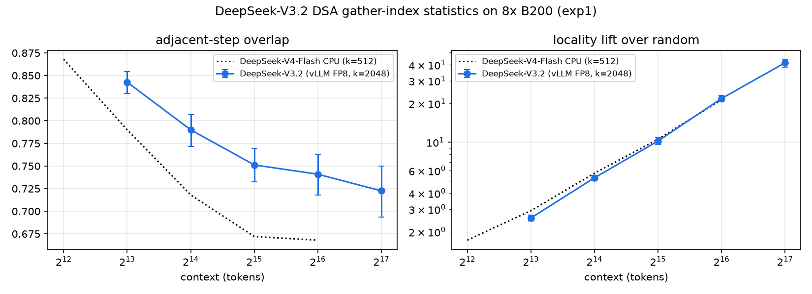
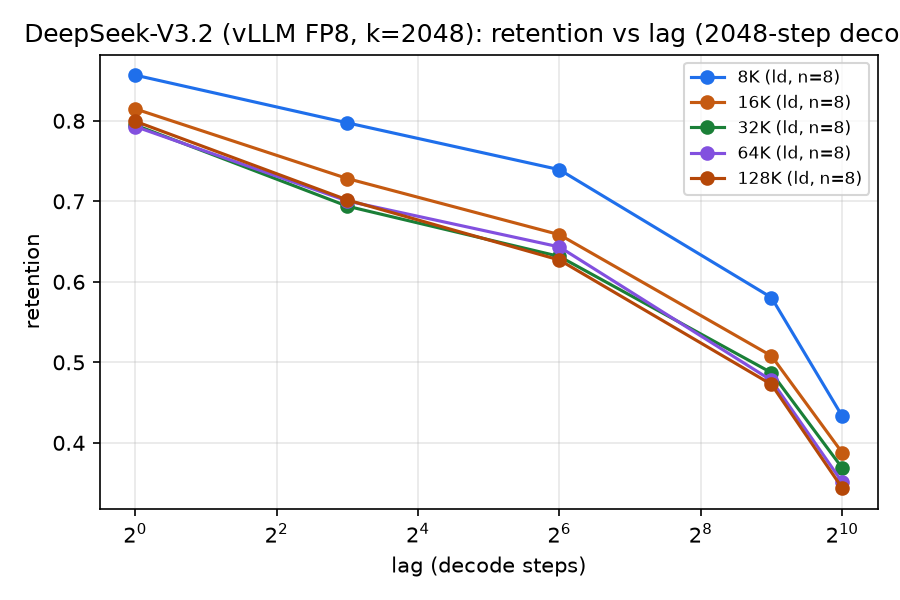
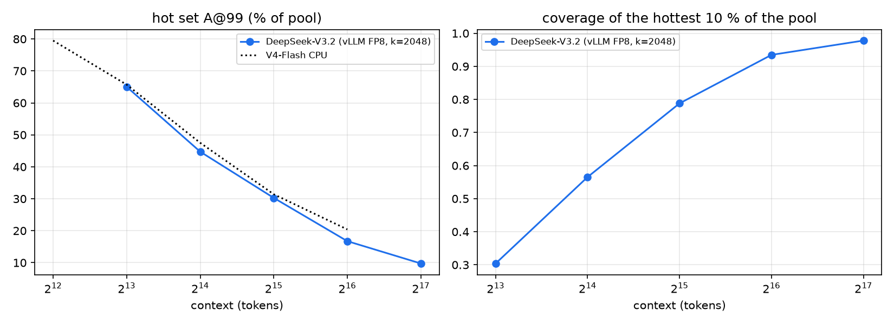
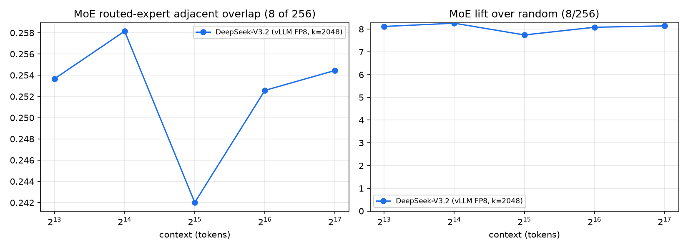

# DeepSeek-V3.2 DSA gather-index statistics on 8x B200 (exp1)

Generated by `scripts/gpu/make_gpu_sweep_summary.py` from sweep_v32.json.
Every number is the mean over runs of the rung (bf + ld unless noted), with 95 % bootstrap CI over runs; run ids are in the CSVs.

## DeepSeek-V3.2 (vLLM FP8, k=2048)

### R1 — KV top-k locality (all runs of the rung)

| context | n | adj. overlap [CI] | lift vs random [CI] | recency baseline | ret@8 | ret@64 | ret@512 (ld) | ret@1024 (ld) | CPU V4 overlap / lift |
|---:|---:|---|---|---:|---:|---:|---:|---:|---|
| 8K | 28 | 0.843 [0.830, 0.854] | 2.56× [2.43, 2.70] | 0.491 | 0.768 | 0.722 | 0.580 | 0.433 | 0.790 / 2.9× |
| 16K | 28 | 0.790 [0.772, 0.807] | 5.27× [5.00, 5.52] | 0.385 | 0.695 | 0.627 | 0.508 | 0.388 | 0.718 / 5.7× |
| 32K | 28 | 0.751 [0.732, 0.770] | 10.19× [9.53, 10.81] | 0.320 | 0.636 | 0.584 | 0.487 | 0.369 | 0.672 / 10.5× |
| 64K | 27 | 0.741 [0.718, 0.763] | 21.87× [20.66, 23.00] | 0.302 | 0.626 | 0.602 | 0.478 | 0.351 | 0.668 / 21.4× |
| 128K | 24 | 0.723 [0.693, 0.750] | 41.49× [38.46, 44.22] | 0.307 | 0.611 | 0.609 | 0.473 | 0.344 | — |

### R2 — MoE routed-expert locality

| context | n | adj. overlap [CI] | lift vs 8/256 [CI] |
|---:|---:|---|---|
| 8K | 28 | 0.254 [0.240, 0.265] | 8.1× [7.7, 8.5] |
| 16K | 28 | 0.258 [0.241, 0.279] | 8.3× [7.7, 8.9] |
| 32K | 28 | 0.242 [0.228, 0.254] | 7.7× [7.3, 8.1] |
| 64K | 27 | 0.253 [0.239, 0.264] | 8.1× [7.7, 8.5] |
| 128K | 24 | 0.254 [0.239, 0.267] | 8.1× [7.6, 8.6] |

### R3 — hot-set coverage

| context | n | pool N | A@99 (% of pool) [CI] | B@99 | top-1 % cov | top-5 % cov | top-10 % cov (MEASURED_TOP10) |
|---:|---:|---:|---|---:|---:|---:|---:|
| 8K | 28 | 6576 | 65.0 [59.8, 70.6] | 72.4 | 0.032 | 0.157 | 0.304 |
| 16K | 28 | 14014 | 44.7 [37.8, 52.1] | 52.1 | 0.068 | 0.317 | 0.565 |
| 32K | 28 | 28271 | 30.3 [24.3, 36.8] | 37.0 | 0.134 | 0.546 | 0.788 |
| 64K | 27 | 60865 | 16.7 [13.1, 20.7] | 22.0 | 0.270 | 0.802 | 0.935 |
| 128K | 24 | 118718 | 9.7 [7.2, 12.3] | 13.2 | 0.472 | 0.924 | 0.978 |

### Accuracy sanity (bf runs, our scorer; no official numbers for these sub-samples)

| context | source | n | accuracy | mean score |
|---:|---|---:|---:|---:|
| 8K | infinitebench | 4 | 0.50 | 0.565 |
| 8K | longbench_v1 | 4 | — | 0.189 |
| 8K | longbench_v2 | 4 | 0.25 | 0.250 |
| 8K | ruler | 8 | 0.62 | 0.625 |
| 16K | infinitebench | 4 | 0.25 | 0.315 |
| 16K | longbench_v1 | 4 | — | 0.230 |
| 16K | longbench_v2 | 4 | 0.25 | 0.250 |
| 16K | ruler | 8 | 0.75 | 0.750 |
| 32K | infinitebench | 4 | 0.50 | 0.586 |
| 32K | longbench_v1 | 4 | — | 0.180 |
| 32K | longbench_v2 | 4 | 0.50 | 0.500 |
| 32K | ruler | 8 | 0.75 | 0.750 |
| 64K | infinitebench | 4 | 0.75 | 0.814 |
| 64K | longbench_v1 | 3 | — | 0.193 |
| 64K | longbench_v2 | 4 | 0.25 | 0.250 |
| 64K | ruler | 8 | 0.88 | 0.875 |
| 128K | infinitebench | 4 | 0.75 | 0.818 |
| 128K | longbench_v2 | 4 | 0.25 | 0.250 |
| 128K | ruler | 8 | 0.75 | 0.750 |

