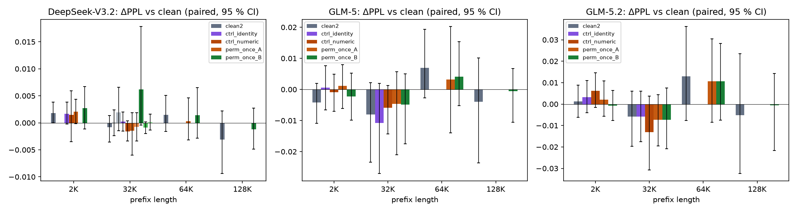

# Accuracy impact of KV-cache re-indexing — paper-ready text and tables (exp3 tier 1)

*Source data: `results.csv`, `per_item.jsonl`, `tier1_{v32,glm52,glm5}.json` in this directory; produced by `scripts/gpu/exp3_tier1.py` + `exp3_tier1_results.py` on 2026-08-29 (8x B200, vLLM 0.28.0, ~15 GPU-h). Tier 2 (30 documents, all modes at every length, 3 seeds, RULER 4 tasks x 3 lengths x 25, LongBench-v2 100, PTB) would tighten the intervals ~1.7x; see `docs/00_doc/PROGRESS.md`.*

## Section text (draft)

**Methodology.** Re-indexing changes *where* a KV entry lives, not *what* it contains, so it must leave the model's predictions unchanged up to floating-point summation order. Comparing generated text is the wrong test: greedy decoding on our stack (vLLM 0.28, 8x B200, TP=8) is not bit-reproducible — identical reruns diverge after 10–24 tokens at near-tie positions, and the texts then drift. Following InfiniGen, we therefore use **perplexity** as the primary metric, measured with teacher forcing so that every configuration scores the same tokens: a document prefix of *P* ∈ {32K, 64K, 128K} tokens is written into the KV cache, the cache is physically re-indexed, and the next 2K tokens are scored against the re-indexed cache. We report two re-indexing implementations — **block-level** (64-token pages moved and the page table updated; the baseline a page-table system would use) and **entry-level** (individual KV rows permuted with no table; the SPLEX design, where indices become physical) — against three references measured in the same engine: an *identical rerun* of the baseline (the numerical noise floor), an *identity* re-index (the mechanism active, nothing moved), and a *batch-composition control* (the same request processed alongside another). Documents are 10 books from InfiniteBench (≥133K tokens); WikiText-2 (2K prefix, 1K scored) serves as a short-context anchor. As a task-level check we run RULER needle retrieval and QA at 32K and 128K with re-indexing applied once after prefill and periodically during decoding (10 % of the prefix every 4 steps). We evaluate three DSA models: DeepSeek-V3.2 (61 layers), GLM-5.2 (78 layers, index sharing) and GLM-5 (78 layers).

**Results.** Table 1 reports perplexity and the paired difference to the baseline with 95 % bootstrap confidence intervals. Across all three models and all prefix lengths, re-indexing changes perplexity by less than the run-to-run noise floor. For DeepSeek-V3.2 at 32K/64K/128K, entry-level re-indexing yields ΔPPL of −0.0009, +0.0014 and −0.0012 against a floor of −0.0008, +0.0015 and −0.0031 (baseline PPL 1.094, 1.136, 1.097); block-level re-indexing gives −0.0015 and +0.0003 at 32K/64K. GLM-5.2 (baseline 1.883/2.215/2.596) shows −0.007/+0.011/−0.001 against a floor of −0.006/+0.013/−0.005, and GLM-5 (1.610/1.888/2.092) −0.005/+0.004/−0.001 against −0.008/+0.007/−0.004. The identity re-index tracks the rerun floor to within 0.0005 PPL, and the batch-composition control produces differences of the same magnitude as re-indexing, confirming that the residual is summation-order noise rather than a systematic effect. On WikiText-2 all configurations lie within ±0.003 PPL of the baseline (3.001, 2.984 and 2.863 for the three models). Per-token log-probability shifts have the same distribution under re-indexing as between identical runs (90th percentile 0.013 vs 0.013 nats for V3.2 at 32K; 0.43 vs 0.44 for GLM-5.2), including the heavy tail caused by mixture-of-experts routing flips at near-ties (≈1.5 % of tokens shift by more than 0.5 nats between identical runs). Of 78 model x dataset x length x mode combinations, 77 fall inside the noise floor; the single exception is one document at one permutation seed (+0.057 PPL), which two further seeds and two further baseline reruns show to be a high-variance document rather than a re-indexing effect.

Task accuracy is likewise unchanged (Table 2): on RULER needle retrieval and QA, DeepSeek-V3.2, GLM-5.2 and GLM-5 answer 16/20, 18/20 and 20/20 items correctly under the baseline, under a one-time re-index and under periodic re-indexing, with the same items missed in every configuration; 16–20 of the 20 generated token streams are bit-identical to the baseline, and the remainder diverge at the same near-tie positions where identical baseline runs diverge.

**Takeaway.** Because attention and the sparse indexer are permutation-invariant over the set of cached entries and positional information is applied at insertion time, re-indexing is invisible to the model: its effect on perplexity and accuracy is indistinguishable from running the unmodified system twice. This holds for both the page-table baseline and the entry-level design, for three DSA models spanning 61–78 layers with and without index sharing, and for contexts up to 128K tokens. (Implementation note: the entry-level design must permute the latent KV rows and the indexer's key rows identically, respecting each cache's in-block layout — the indexer stores a 64-token block as 64x128 fp8 values followed by 64 4-byte scales; an early version that ignored this broke retrieval outright, which shows the test has teeth.)

## Table 1 — Perplexity under KV-cache re-indexing (teacher-forced, 2K scored tokens; ΔPPL paired vs baseline, 95 % bootstrap CI over documents; token |Δlogp| p90 in nats)

| model | dataset | prefix | configuration | n | PPL | ΔPPL [95 % CI] | token p90 | within floor |
|---|---|---:|---|---:|---:|---|---:|:-:|
| DeepSeek-V3.2 | WikiText-2 | 2K | baseline | 50 | 3.0006 | +0.0000 [+0.0000, +0.0000] | 0.000 | — |
| DeepSeek-V3.2 | WikiText-2 | 2K | identical rerun (noise floor) | 50 | 3.0024 | +0.0018 [-0.0000, +0.0039] | 0.059 | — |
| DeepSeek-V3.2 | WikiText-2 | 2K | identity re-index (hook on) | 50 | 3.0023 | +0.0017 [-0.0002, +0.0038] | 0.058 | ✓ |
| DeepSeek-V3.2 | WikiText-2 | 2K | batch-composition control | 50 | 3.0021 | +0.0015 [-0.0035, +0.0059] | 0.134 | ✓ |
| DeepSeek-V3.2 | WikiText-2 | 2K | block-level re-index (impl A) | 50 | 3.0027 | +0.0021 [-0.0002, +0.0044] | 0.065 | ✓ |
| DeepSeek-V3.2 | WikiText-2 | 2K | entry-level re-index (impl B) | 50 | 3.0033 | +0.0027 [-0.0011, +0.0067] | 0.195 | ✓ |
| DeepSeek-V3.2 | long books | 32K | baseline | 10 | 1.0939 | +0.0000 [+0.0000, +0.0000] | 0.000 | — |
| DeepSeek-V3.2 | long books | 32K | identical rerun (noise floor) | 10 | 1.0931 | -0.0008 [-0.0035, +0.0013] | 0.013 | — |
| DeepSeek-V3.2 | long books | 32K | identical rerun #3 | 10 | 1.0940 | +0.0000 [-0.0024, +0.0024] | 0.012 | ✓ |
| DeepSeek-V3.2 | long books | 32K | identical rerun #4 | 10 | 1.0959 | +0.0020 [-0.0015, +0.0066] | 0.012 | ✓ |
| DeepSeek-V3.2 | long books | 32K | identity re-index (hook on) | 10 | 1.0942 | +0.0002 [-0.0015, +0.0020] | 0.013 | ✓ |
| DeepSeek-V3.2 | long books | 32K | batch-composition control | 10 | 1.0923 | -0.0016 [-0.0033, +0.0004] | 0.012 | ✓ |
| DeepSeek-V3.2 | long books | 32K | block-level re-index (impl A) | 10 | 1.0925 | -0.0015 [-0.0060, +0.0019] | 0.013 | ✓ |
| DeepSeek-V3.2 | long books | 32K | block-level re-index, seed 8 | 10 | 1.0932 | -0.0007 [-0.0033, +0.0019] | 0.012 | ✓ |
| DeepSeek-V3.2 | long books | 32K | entry-level re-index (impl B) | 10 | 1.1001 | +0.0062 [-0.0004, +0.0178] | 0.014 | ✗ |
| DeepSeek-V3.2 | long books | 32K | entry-level re-index, seed 8 | 10 | 1.0931 | -0.0009 [-0.0020, +0.0002] | 0.012 | ✓ |
| DeepSeek-V3.2 | long books | 32K | entry-level re-index, seed 9 | 10 | 1.0941 | +0.0001 [-0.0014, +0.0016] | 0.013 | ✓ |
| DeepSeek-V3.2 | long books | 64K | baseline | 10 | 1.1357 | +0.0000 [+0.0000, +0.0000] | 0.000 | — |
| DeepSeek-V3.2 | long books | 64K | identical rerun (noise floor) | 10 | 1.1372 | +0.0015 [-0.0016, +0.0051] | 0.025 | — |
| DeepSeek-V3.2 | long books | 64K | block-level re-index (impl A) | 10 | 1.1360 | +0.0003 [-0.0032, +0.0046] | 0.027 | ✓ |
| DeepSeek-V3.2 | long books | 64K | entry-level re-index (impl B) | 10 | 1.1371 | +0.0014 [-0.0029, +0.0065] | 0.026 | ✓ |
| DeepSeek-V3.2 | long books | 128K | baseline | 10 | 1.0966 | +0.0000 [+0.0000, +0.0000] | 0.000 | — |
| DeepSeek-V3.2 | long books | 128K | identical rerun (noise floor) | 10 | 1.0935 | -0.0031 [-0.0094, +0.0022] | 0.022 | — |
| DeepSeek-V3.2 | long books | 128K | entry-level re-index (impl B) | 10 | 1.0954 | -0.0012 [-0.0048, +0.0027] | 0.022 | ✓ |
| GLM-5.2 | WikiText-2 | 2K | baseline | 50 | 2.9835 | +0.0000 [+0.0000, +0.0000] | 0.000 | — |
| GLM-5.2 | WikiText-2 | 2K | identical rerun (noise floor) | 50 | 2.9847 | +0.0013 [-0.0062, +0.0088] | 0.353 | — |
| GLM-5.2 | WikiText-2 | 2K | identity re-index (hook on) | 50 | 2.9867 | +0.0032 [-0.0041, +0.0109] | 0.352 | ✓ |
| GLM-5.2 | WikiText-2 | 2K | batch-composition control | 50 | 2.9896 | +0.0062 [-0.0016, +0.0146] | 0.350 | ✓ |
| GLM-5.2 | WikiText-2 | 2K | block-level re-index (impl A) | 50 | 2.9856 | +0.0021 [-0.0056, +0.0108] | 0.349 | ✓ |
| GLM-5.2 | WikiText-2 | 2K | entry-level re-index (impl B) | 50 | 2.9827 | -0.0008 [-0.0076, +0.0063] | 0.351 | ✓ |
| GLM-5.2 | long books | 32K | baseline | 10 | 1.8828 | +0.0000 [+0.0000, +0.0000] | 0.000 | — |
| GLM-5.2 | long books | 32K | identical rerun (noise floor) | 10 | 1.8770 | -0.0058 [-0.0198, +0.0060] | 0.437 | — |
| GLM-5.2 | long books | 32K | identity re-index (hook on) | 10 | 1.8770 | -0.0058 [-0.0176, +0.0060] | 0.437 | ✓ |
| GLM-5.2 | long books | 32K | batch-composition control | 10 | 1.8697 | -0.0131 [-0.0308, +0.0037] | 0.429 | ✓ |
| GLM-5.2 | long books | 32K | block-level re-index (impl A) | 10 | 1.8755 | -0.0073 [-0.0195, +0.0043] | 0.414 | ✓ |
| GLM-5.2 | long books | 32K | entry-level re-index (impl B) | 10 | 1.8755 | -0.0073 [-0.0209, +0.0074] | 0.431 | ✓ |
| GLM-5.2 | long books | 64K | baseline | 10 | 2.2146 | +0.0000 [+0.0000, +0.0000] | 0.000 | — |
| GLM-5.2 | long books | 64K | identical rerun (noise floor) | 10 | 2.2276 | +0.0130 [-0.0076, +0.0361] | 0.540 | — |
| GLM-5.2 | long books | 64K | block-level re-index (impl A) | 10 | 2.2252 | +0.0106 [-0.0084, +0.0305] | 0.555 | ✓ |
| GLM-5.2 | long books | 64K | entry-level re-index (impl B) | 10 | 2.2253 | +0.0107 [-0.0075, +0.0283] | 0.564 | ✓ |
| GLM-5.2 | long books | 128K | baseline | 10 | 2.5960 | +0.0000 [+0.0000, +0.0000] | 0.000 | — |
| GLM-5.2 | long books | 128K | identical rerun (noise floor) | 10 | 2.5908 | -0.0052 [-0.0325, +0.0234] | 0.664 | — |
| GLM-5.2 | long books | 128K | entry-level re-index (impl B) | 10 | 2.5955 | -0.0005 [-0.0217, +0.0143] | 0.636 | ✓ |
| GLM-5 | WikiText-2 | 2K | baseline | 50 | 2.8630 | +0.0000 [+0.0000, +0.0000] | 0.000 | — |
| GLM-5 | WikiText-2 | 2K | identical rerun (noise floor) | 50 | 2.8588 | -0.0042 [-0.0109, +0.0020] | 0.342 | — |
| GLM-5 | WikiText-2 | 2K | identity re-index (hook on) | 50 | 2.8636 | +0.0006 [-0.0065, +0.0076] | 0.344 | ✓ |
| GLM-5 | WikiText-2 | 2K | batch-composition control | 50 | 2.8621 | -0.0009 [-0.0070, +0.0050] | 0.342 | ✓ |
| GLM-5 | WikiText-2 | 2K | block-level re-index (impl A) | 50 | 2.8641 | +0.0012 [-0.0061, +0.0079] | 0.341 | ✓ |
| GLM-5 | WikiText-2 | 2K | entry-level re-index (impl B) | 50 | 2.8607 | -0.0023 [-0.0099, +0.0052] | 0.345 | ✓ |
| GLM-5 | long books | 32K | baseline | 10 | 1.6099 | +0.0000 [+0.0000, +0.0000] | 0.000 | — |
| GLM-5 | long books | 32K | identical rerun (noise floor) | 10 | 1.6018 | -0.0081 [-0.0234, +0.0022] | 0.261 | — |
| GLM-5 | long books | 32K | identity re-index (hook on) | 10 | 1.5991 | -0.0108 [-0.0271, +0.0020] | 0.270 | ✓ |
| GLM-5 | long books | 32K | batch-composition control | 10 | 1.6040 | -0.0059 [-0.0143, +0.0013] | 0.260 | ✓ |
| GLM-5 | long books | 32K | block-level re-index (impl A) | 10 | 1.6053 | -0.0046 [-0.0210, +0.0057] | 0.263 | ✓ |
| GLM-5 | long books | 32K | entry-level re-index (impl B) | 10 | 1.6050 | -0.0049 [-0.0175, +0.0051] | 0.253 | ✓ |
| GLM-5 | long books | 64K | baseline | 10 | 1.8880 | +0.0000 [+0.0000, +0.0000] | 0.000 | — |
| GLM-5 | long books | 64K | identical rerun (noise floor) | 10 | 1.8950 | +0.0070 [-0.0027, +0.0193] | 0.348 | — |
| GLM-5 | long books | 64K | block-level re-index (impl A) | 10 | 1.8912 | +0.0032 [-0.0140, +0.0202] | 0.345 | ✓ |
| GLM-5 | long books | 64K | entry-level re-index (impl B) | 10 | 1.8921 | +0.0041 [-0.0052, +0.0154] | 0.341 | ✓ |
| GLM-5 | long books | 128K | baseline | 10 | 2.0919 | +0.0000 [+0.0000, +0.0000] | 0.000 | — |
| GLM-5 | long books | 128K | identical rerun (noise floor) | 10 | 2.0879 | -0.0040 [-0.0237, +0.0102] | 0.386 | — |
| GLM-5 | long books | 128K | entry-level re-index (impl B) | 10 | 2.0913 | -0.0006 [-0.0105, +0.0067] | 0.394 | ✓ |

*Rows marked — are the baseline itself or the floor definition. The single ✗ (DeepSeek-V3.2, 32K, entry-level seed 7) is one document (+0.057); seeds 8 and 9 on the same documents and two extra baseline reruns are within the floor.*

## Table 2 — Task accuracy under re-indexing (RULER niah_single_2 + qa_1, 5 + 5 items per length, greedy)

| model | context | configuration | correct | Δ vs baseline | token streams identical to baseline |
|---|---:|---|---:|---:|---:|
| DeepSeek-V3.2 | 32K | baseline | 8/10 | +0.00 | 10/10 |
| DeepSeek-V3.2 | 128K | baseline | 8/10 | +0.00 | 10/10 |
| DeepSeek-V3.2 | 32K | entry-level re-index (impl B) | 8/10 | +0.00 | 8/10 |
| DeepSeek-V3.2 | 128K | entry-level re-index (impl B) | 8/10 | +0.00 | 8/10 |
| DeepSeek-V3.2 | 32K | entry-level, periodic re-index | 8/10 | +0.00 | 8/10 |
| DeepSeek-V3.2 | 128K | entry-level, periodic re-index | 8/10 | +0.00 | 8/10 |
| GLM-5.2 | 32K | baseline | 9/10 | +0.00 | 10/10 |
| GLM-5.2 | 128K | baseline | 9/10 | +0.00 | 10/10 |
| GLM-5.2 | 32K | entry-level re-index (impl B) | 9/10 | +0.00 | 10/10 |
| GLM-5.2 | 128K | entry-level re-index (impl B) | 9/10 | +0.00 | 8/10 |
| GLM-5.2 | 32K | entry-level, periodic re-index | 9/10 | +0.00 | 10/10 |
| GLM-5.2 | 128K | entry-level, periodic re-index | 9/10 | +0.00 | 8/10 |
| GLM-5 | 32K | baseline | 10/10 | +0.00 | 10/10 |
| GLM-5 | 128K | baseline | 10/10 | +0.00 | 10/10 |
| GLM-5 | 32K | entry-level re-index (impl B) | 10/10 | +0.00 | 10/10 |
| GLM-5 | 128K | entry-level re-index (impl B) | 10/10 | +0.00 | 8/10 |
| GLM-5 | 32K | entry-level, periodic re-index | 10/10 | +0.00 | 10/10 |
| GLM-5 | 128K | entry-level, periodic re-index | 10/10 | +0.00 | 8/10 |

