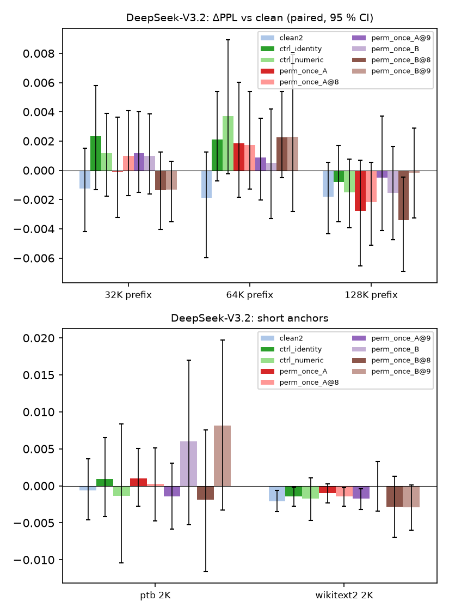

# exp3 tier 2 — re-index accuracy (perplexity primary, generation accuracy secondary)

Teacher-forced perplexity of the scored continuation after the KV prefix was physically re-indexed (impl A: 64-token block permutation with block-table update; impl B: per-token row permutation, block table untouched; `@8`/`@9` = permutation seeds 8/9, no suffix = seed 7). `clean2` = identical rerun = run-to-run noise floor; `ctrl_identity` = hook active with identity permutation; `ctrl_numeric` = same item processed alongside a filler request. Verdict `equivalent_to_noise_floor`: |mean ΔPPL| within the clean2 CI bound and per-token |Δlogprob| p90 within 1.5× max(floor, ctrl_numeric).

| model | corpus | prefix | mode | impl | n | PPL | ΔPPL vs clean [95 % CI] | token |Δlogprob| mean / p90 | equivalent |
|---|---|---:|---|---|---:|---:|---|---|---|
| DeepSeek-V3.2 | longbook | 32768 | clean | - | 30 | 1.3058 | +0.00000 [+0.00000, +0.00000] | 0.0000 / 0.0000 | — |
| DeepSeek-V3.2 | longbook | 32768 | clean2 | - | 30 | 1.3046 | -0.00125 [-0.00419, +0.00151] | 0.0399 / 0.0483 | — |
| DeepSeek-V3.2 | longbook | 32768 | ctrl_identity | B | 30 | 1.3082 | +0.00235 [-0.00134, +0.00578] | 0.0407 / 0.0487 | True |
| DeepSeek-V3.2 | longbook | 32768 | ctrl_numeric | - | 30 | 1.3070 | +0.00116 [-0.00177, +0.00390] | 0.0408 / 0.0492 | True |
| DeepSeek-V3.2 | longbook | 32768 | perm_once_A | A | 30 | 1.3058 | -0.00007 [-0.00321, +0.00362] | 0.0416 / 0.0510 | True |
| DeepSeek-V3.2 | longbook | 32768 | perm_once_A@8 | A | 30 | 1.3068 | +0.00099 [-0.00175, +0.00408] | 0.0415 / 0.0511 | True |
| DeepSeek-V3.2 | longbook | 32768 | perm_once_A@9 | A | 30 | 1.3070 | +0.00116 [-0.00150, +0.00399] | 0.0405 / 0.0508 | True |
| DeepSeek-V3.2 | longbook | 32768 | perm_once_B | B | 30 | 1.3068 | +0.00100 [-0.00162, +0.00386] | 0.0419 / 0.0506 | True |
| DeepSeek-V3.2 | longbook | 32768 | perm_once_B@8 | B | 30 | 1.3045 | -0.00135 [-0.00402, +0.00126] | 0.0412 / 0.0503 | True |
| DeepSeek-V3.2 | longbook | 32768 | perm_once_B@9 | B | 30 | 1.3045 | -0.00132 [-0.00351, +0.00063] | 0.0408 / 0.0493 | True |
| DeepSeek-V3.2 | longbook | 65536 | clean | - | 30 | 1.2678 | +0.00000 [+0.00000, +0.00000] | 0.0000 / 0.0000 | — |
| DeepSeek-V3.2 | longbook | 65536 | clean2 | - | 30 | 1.2659 | -0.00189 [-0.00598, +0.00124] | 0.0478 / 0.0647 | — |
| DeepSeek-V3.2 | longbook | 65536 | ctrl_identity | B | 30 | 1.2699 | +0.00212 [-0.00072, +0.00539] | 0.0488 / 0.0658 | True |
| DeepSeek-V3.2 | longbook | 65536 | ctrl_numeric | - | 30 | 1.2715 | +0.00373 [-0.00022, +0.00894] | 0.0486 / 0.0672 | True |
| DeepSeek-V3.2 | longbook | 65536 | perm_once_A | A | 30 | 1.2696 | +0.00185 [-0.00183, +0.00601] | 0.0481 / 0.0647 | True |
| DeepSeek-V3.2 | longbook | 65536 | perm_once_A@8 | A | 30 | 1.2695 | +0.00172 [-0.00128, +0.00540] | 0.0491 / 0.0645 | True |
| DeepSeek-V3.2 | longbook | 65536 | perm_once_A@9 | A | 30 | 1.2687 | +0.00088 [-0.00204, +0.00356] | 0.0487 / 0.0654 | True |
| DeepSeek-V3.2 | longbook | 65536 | perm_once_B | B | 30 | 1.2683 | +0.00049 [-0.00330, +0.00420] | 0.0486 / 0.0633 | True |
| DeepSeek-V3.2 | longbook | 65536 | perm_once_B@8 | B | 30 | 1.2700 | +0.00225 [-0.00049, +0.00537] | 0.0482 / 0.0625 | True |
| DeepSeek-V3.2 | longbook | 65536 | perm_once_B@9 | B | 30 | 1.2701 | +0.00231 [-0.00280, +0.00792] | 0.0489 / 0.0655 | True |
| DeepSeek-V3.2 | longbook | 131072 | clean | - | 30 | 1.3674 | +0.00000 [+0.00000, +0.00000] | 0.0000 / 0.0000 | — |
| DeepSeek-V3.2 | longbook | 131072 | clean2 | - | 30 | 1.3656 | -0.00180 [-0.00433, +0.00054] | 0.0514 / 0.0915 | — |
| DeepSeek-V3.2 | longbook | 131072 | ctrl_identity | B | 30 | 1.3666 | -0.00078 [-0.00352, +0.00171] | 0.0504 / 0.0889 | True |
| DeepSeek-V3.2 | longbook | 131072 | ctrl_numeric | - | 30 | 1.3659 | -0.00150 [-0.00393, +0.00076] | 0.0506 / 0.0929 | True |
| DeepSeek-V3.2 | longbook | 131072 | perm_once_A | A | 30 | 1.3646 | -0.00276 [-0.00654, +0.00068] | 0.0511 / 0.0929 | True |
| DeepSeek-V3.2 | longbook | 131072 | perm_once_A@8 | A | 30 | 1.3652 | -0.00216 [-0.00512, +0.00053] | 0.0514 / 0.0923 | True |
| DeepSeek-V3.2 | longbook | 131072 | perm_once_A@9 | A | 30 | 1.3669 | -0.00050 [-0.00410, +0.00372] | 0.0507 / 0.0942 | True |
| DeepSeek-V3.2 | longbook | 131072 | perm_once_B | B | 30 | 1.3659 | -0.00154 [-0.00476, +0.00162] | 0.0501 / 0.0917 | True |
| DeepSeek-V3.2 | longbook | 131072 | perm_once_B@8 | B | 30 | 1.3640 | -0.00342 [-0.00691, -0.00045] | 0.0508 / 0.0924 | True |
| DeepSeek-V3.2 | longbook | 131072 | perm_once_B@9 | B | 30 | 1.3672 | -0.00016 [-0.00327, +0.00288] | 0.0500 / 0.0898 | True |
| DeepSeek-V3.2 | ptb | 2048 | clean | - | 32 | 5.7974 | +0.00000 [+0.00000, +0.00000] | 0.0000 / 0.0000 | — |
| DeepSeek-V3.2 | ptb | 2048 | clean2 | - | 32 | 5.7968 | -0.00058 [-0.00457, +0.00367] | 0.0274 / 0.0960 | — |
| DeepSeek-V3.2 | ptb | 2048 | ctrl_identity | B | 32 | 5.7984 | +0.00097 [-0.00417, +0.00656] | 0.0281 / 0.0983 | True |
| DeepSeek-V3.2 | ptb | 2048 | ctrl_numeric | - | 32 | 5.7961 | -0.00133 [-0.01043, +0.00834] | 0.0763 / 0.2162 | True |
| DeepSeek-V3.2 | ptb | 2048 | perm_once_A | A | 32 | 5.7984 | +0.00098 [-0.00275, +0.00502] | 0.0271 / 0.0950 | True |
| DeepSeek-V3.2 | ptb | 2048 | perm_once_A@8 | A | 32 | 5.7977 | +0.00028 [-0.00474, +0.00513] | 0.0259 / 0.0900 | True |
| DeepSeek-V3.2 | ptb | 2048 | perm_once_A@9 | A | 32 | 5.7959 | -0.00146 [-0.00587, +0.00303] | 0.0262 / 0.0921 | True |
| DeepSeek-V3.2 | ptb | 2048 | perm_once_B | B | 32 | 5.8034 | +0.00598 [-0.00528, +0.01697] | 0.0889 / 0.2382 | False |
| DeepSeek-V3.2 | ptb | 2048 | perm_once_B@8 | B | 32 | 5.7955 | -0.00189 [-0.01161, +0.00755] | 0.0894 / 0.2405 | True |
| DeepSeek-V3.2 | ptb | 2048 | perm_once_B@9 | B | 32 | 5.8055 | +0.00815 [-0.00326, +0.01972] | 0.0901 / 0.2422 | False |
| DeepSeek-V3.2 | wikitext2 | 2048 | clean | - | 93 | 3.2438 | +0.00000 [+0.00000, +0.00000] | 0.0000 / 0.0000 | — |
| DeepSeek-V3.2 | wikitext2 | 2048 | clean2 | - | 93 | 3.2417 | -0.00208 [-0.00353, -0.00062] | 0.0209 / 0.0568 | — |
| DeepSeek-V3.2 | wikitext2 | 2048 | ctrl_identity | B | 93 | 3.2423 | -0.00145 [-0.00278, -0.00015] | 0.0213 / 0.0570 | True |
| DeepSeek-V3.2 | wikitext2 | 2048 | ctrl_numeric | - | 93 | 3.2421 | -0.00171 [-0.00468, +0.00104] | 0.0575 / 0.1702 | True |
| DeepSeek-V3.2 | wikitext2 | 2048 | perm_once_A | A | 93 | 3.2428 | -0.00100 [-0.00234, +0.00028] | 0.0207 / 0.0552 | True |
| DeepSeek-V3.2 | wikitext2 | 2048 | perm_once_A@8 | A | 93 | 3.2424 | -0.00143 [-0.00273, -0.00024] | 0.0211 / 0.0540 | True |
| DeepSeek-V3.2 | wikitext2 | 2048 | perm_once_A@9 | A | 93 | 3.2421 | -0.00173 [-0.00319, -0.00036] | 0.0202 / 0.0517 | True |
| DeepSeek-V3.2 | wikitext2 | 2048 | perm_once_B | B | 93 | 3.2437 | -0.00011 [-0.00343, +0.00331] | 0.0684 / 0.2000 | True |
| DeepSeek-V3.2 | wikitext2 | 2048 | perm_once_B@8 | B | 93 | 3.2410 | -0.00283 [-0.00693, +0.00131] | 0.0688 / 0.1997 | True |
| DeepSeek-V3.2 | wikitext2 | 2048 | perm_once_B@9 | B | 93 | 3.2409 | -0.00290 [-0.00603, +0.00009] | 0.0686 / 0.1982 | True |

| model | benchmark | context | mode | n | accuracy | Δ vs clean [95 % CI] | flips | identical token streams | median first divergence |
|---|---|---:|---|---:|---:|---|---:|---:|---:|
| DeepSeek-V3.2 | longbench_v2:Code Repository Understanding | mixed | clean | 10 | 0.500 | +0.000 [+0.000, +0.000] | 0 | 10/10 | 9999.0 |
| DeepSeek-V3.2 | longbench_v2:Long In-context Learning | mixed | clean | 15 | 0.600 | +0.000 [+0.000, +0.000] | 0 | 15/15 | 9999 |
| DeepSeek-V3.2 | longbench_v2_all | pooled | clean | 25 | 0.560 | +0.000 [+0.000, +0.000] | 0 | 25/25 | 9999 |
| DeepSeek-V3.2 | ruler_niah_multikey_2 | 32768 | clean | 25 | 1.000 | +0.000 [+0.000, +0.000] | 0 | 25/25 | 9999 |
| DeepSeek-V3.2 | ruler_niah_multikey_2 | 65536 | clean | 25 | 1.000 | +0.000 [+0.000, +0.000] | 0 | 25/25 | 9999 |
| DeepSeek-V3.2 | ruler_niah_multikey_2 | 131072 | clean | 25 | 1.000 | +0.000 [+0.000, +0.000] | 0 | 25/25 | 9999 |
| DeepSeek-V3.2 | ruler_niah_single_2 | 32768 | clean | 25 | 1.000 | +0.000 [+0.000, +0.000] | 0 | 25/25 | 9999 |
| DeepSeek-V3.2 | ruler_niah_single_2 | 65536 | clean | 25 | 1.000 | +0.000 [+0.000, +0.000] | 0 | 25/25 | 9999 |
| DeepSeek-V3.2 | ruler_niah_single_2 | 131072 | clean | 25 | 1.000 | +0.000 [+0.000, +0.000] | 0 | 25/25 | 9999 |
| DeepSeek-V3.2 | ruler_qa_1 | 32768 | clean | 25 | 0.720 | +0.000 [+0.000, +0.000] | 0 | 25/25 | 9999 |
| DeepSeek-V3.2 | ruler_qa_1 | 65536 | clean | 25 | 0.680 | +0.000 [+0.000, +0.000] | 0 | 25/25 | 9999 |
| DeepSeek-V3.2 | ruler_qa_1 | 131072 | clean | 25 | 0.560 | +0.000 [+0.000, +0.000] | 0 | 25/25 | 9999 |
| DeepSeek-V3.2 | ruler_vt | 32768 | clean | 25 | 1.000 | +0.000 [+0.000, +0.000] | 0 | 25/25 | 9999 |
| DeepSeek-V3.2 | ruler_vt | 65536 | clean | 25 | 1.000 | +0.000 [+0.000, +0.000] | 0 | 25/25 | 9999 |
| DeepSeek-V3.2 | ruler_vt | 131072 | clean | 25 | 1.000 | +0.000 [+0.000, +0.000] | 0 | 25/25 | 9999 |
| DeepSeek-V3.2 | ruler_all | pooled | clean | 300 | 0.913 | +0.000 [+0.000, +0.000] | 0 | 300/300 | 9999.0 |

